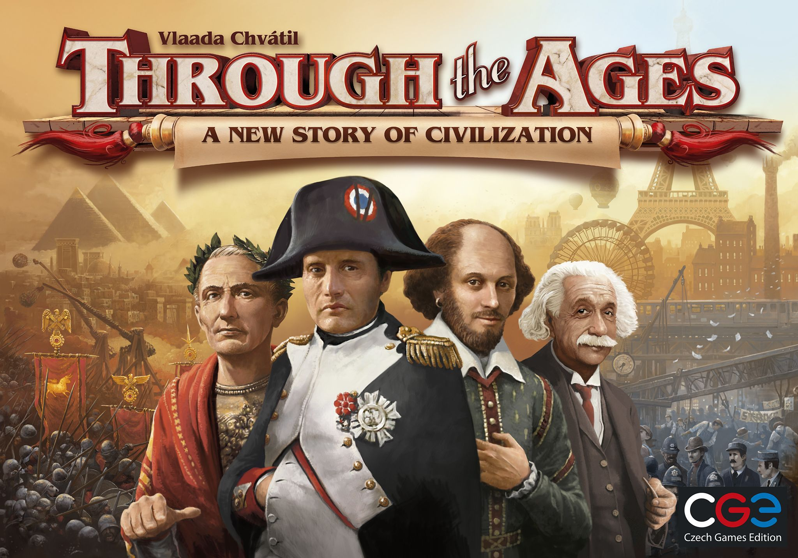

---
output:
  md_document:
    variant: markdown_github
---

<!-- README.md is generated from README.Rmd. Please edit that file -->

```{r, echo = FALSE}
knitr::opts_chunk$set(
  collapse = TRUE,
  comment = "#>",
  fig.path = "README-"
)
```

# Notes

- Data for this package is retrieved from [here](https://www.kaggle.com/mrpantherson/board-game-data#bgg_db_1806.csv).

# boardgamegeek

Do you like playing board games? Do you want to know which board game will be your favourite? This package contains data from the world's biggest board game website "Board Game Geek", and provides functions for you to search your favourite board games.

## Repository structure

- R scripts for functions are under ["R"](./R)
- Test scripts are under ["tests"](./tests)
- HTML generated by vignettes is ["boardgamegeek.html"](./doc/boardgamegeek.html)

## Installation

```{r installation, eval = FALSE}
devtools::install_github("STAT545-UBC-students/hw07-zjbthomas/boardgamegeek")
```
  
## Quick demo

### Data frame `bgg_db`

This package contains a data frame called `bgg_db`, with around 5,000 top board games from Board Game Geek in Jun., 2018. `bgg_db` contains 20 columns, including numes of board games, number of players, play time, ratings, designers, etc.

```{r}
suppressPackageStartupMessages(library(boardgamegeek))
suppressPackageStartupMessages(library(tidyverse))
glimpse(bgg_db)
```

### Search functions

This package provides the following six functions to search board games by their ID, part of name, released year, one of their mechanic, one of their category, or designer.

```{r, warning=FALSE}
# search by game ID
search_by_game_id(102794) %>% 
  select(rank, game_id, names, year, designer) %>% 
  knitr::kable(col.names = c("Rank", "Game ID", "Name", "Year", "Designer"))

# search by name
search_by_name("Mansions of Madness: Second Edition") %>% 
  select(rank, game_id, names, year, designer) %>% 
  knitr::kable(col.names = c("Rank", "Game ID", "Name", "Year", "Designer"))

# search by year
search_by_year(2017) %>% 
  select(rank, game_id, names, year, designer) %>% 
  head() %>% 
  knitr::kable(col.names = c("Rank", "Game ID", "Name", "Year", "Designer"))

# search by mechanic
search_by_mechanic("Action") %>%
  # concatenate mechanic
  rowwise %>% 
  mutate(
    mechanic = str_c(mechanic, collapse = ", ")
  ) %>% 
  select(rank, game_id, names, mechanic) %>%
  head() %>% 
  knitr::kable(col.names = c("Rank", "Game ID", "Name", "Mechanic"))

# search by category
search_by_category("Dice") %>% 
  # concatenate category
  rowwise %>% 
  mutate(
    category = str_c(category, collapse = ", ")
  ) %>% 
  select(rank, game_id, names, category) %>%
  head() %>% 
  knitr::kable(col.names = c("Rank", "Game ID", "Name", "Category"))


# search by designer
search_by_designer("Manuel Rozoy") %>% 
  select(rank, game_id, names, year, designer) %>% 
  head() %>% 
  knitr::kable(col.names = c("Rank", "Game ID", "Name", "Year", "Designer"))
```

### Recommandation functions

This package provides the following three functions to search board games by number of players, play time, or age range.

```{r}
# recommand by min and max players
recommand_by_number_of_player(min = 2, max = 3) %>% 
  select(rank, game_id, names, min_players, max_players) %>% 
  head() %>% 
  knitr::kable(col.names = c("Rank", "Game ID", "Name", "Min. Players", "Max. Players"))

# recommand by min and max time
recommand_by_time(min = 10, max = 80) %>% 
  select(rank, game_id, names, avg_time, min_time, max_time) %>% 
  head() %>% 
  knitr::kable(col.names = c("Rank", "Game ID", "Name", "Avg. Play Time", "Min. Play Time", "Max. Play Time"))

# recommand by min age
recommand_by_age(14) %>% 
  select(rank, game_id, names, age) %>% 
  head() %>% 
  knitr::kable(col.names = c("Rank", "Game ID", "Name", "Min. Age"))
```

### Other funny ideas!

There are some other fields not used in designing functions in these packages, but they are interesting to explore! For example, we can make web cralwer based on `bgg_url`, display images using `image_url`, rank board games based on how many people `owned` them!

Here, I show one of my favourite game, "Through the Ages"!

```{r, message=FALSE}
download.file(as.character(bgg_db$image_url[3]), "./images/182028.jpg", mode = "wb")
```


