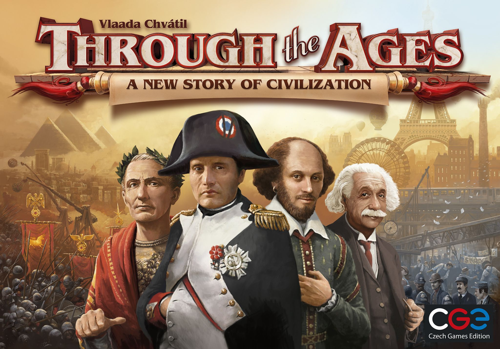

<!-- README.md is generated from README.Rmd. Please edit that file -->
Notes
=====

-   Data for this package is retrieved from
    [here](https://www.kaggle.com/mrpantherson/board-game-data#bgg_db_1806.csv).

boardgamegeek
=============

Do you like playing board games? Do you want to know which board game
will be your favourite? This package contains data from the world’s
biggest board game website “Board Game Geek”, and provides functions for
you to search your favourite board games.

Repository structure
--------------------

-   R scripts for functions are under [“R”](./R)
-   Test scripts are under [“tests”](./tests)
-   HTML generated by vignettes is
    [“boardgamegeek.html”](./doc/boardgamegeek.html)

Installation
------------

``` r
devtools::install_github("STAT545-UBC-students/hw07-zjbthomas/boardgamegeek")
```

Quick demo
----------

### Data frame `bgg_db`

This package contains a data frame called `bgg_db`, with around 5,000
top board games from Board Game Geek in Jun., 2018. `bgg_db` contains 20
columns, including numes of board games, number of players, play time,
ratings, designers, etc.

``` r
suppressPackageStartupMessages(library(boardgamegeek))
suppressPackageStartupMessages(library(tidyverse))
glimpse(bgg_db)
#> Observations: 4,999
#> Variables: 20
#> $ rank        <int> 1, 2, 3, 4, 5, 6, 7, 8, 9, 10, 11, 12, 13, 14, 15,...
#> $ bgg_url     <fct> https://boardgamegeek.com/boardgame/174430/gloomha...
#> $ game_id     <int> 174430, 161936, 182028, 167791, 12333, 187645, 169...
#> $ names       <fct> Gloomhaven, Pandemic Legacy: Season 1, Through the...
#> $ min_players <int> 1, 2, 2, 1, 2, 2, 1, 2, 2, 1, 1, 2, 2, 2, 1, 2, 1,...
#> $ max_players <int> 4, 4, 4, 5, 2, 4, 5, 5, 4, 4, 4, 4, 2, 4, 7, 5, 5,...
#> $ avg_time    <int> 120, 60, 240, 120, 180, 240, 115, 150, 150, 1000, ...
#> $ min_time    <int> 60, 60, 180, 120, 120, 180, 90, 60, 75, 5, 60, 30,...
#> $ max_time    <int> 120, 60, 240, 120, 180, 240, 115, 150, 150, 1000, ...
#> $ year        <int> 2017, 2015, 2015, 2016, 2005, 2016, 2016, 2012, 20...
#> $ avg_rating  <dbl> 8.98893, 8.66140, 8.60673, 8.38461, 8.33954, 8.474...
#> $ geek_rating <dbl> 8.61858, 8.50163, 8.30183, 8.19914, 8.19787, 8.165...
#> $ num_votes   <int> 15376, 26063, 12352, 26004, 31301, 13336, 29219, 2...
#> $ image_url   <fct> https://cf.geekdo-images.com/original/img/lDN358Rg...
#> $ age         <int> 12, 13, 14, 12, 13, 14, 14, 12, 12, 14, 12, 12, 10...
#> $ mechanic    <list> [<"Action / Movement Programming", "Co-operative ...
#> $ owned       <int> 25928, 41605, 15848, 33340, 42952, 20682, 38279, 3...
#> $ category    <list> [<"Adventure", "Exploration", "Fantasy", "Fightin...
#> $ designer    <fct> Isaac Childres, Rob Daviau, Matt Leacock, Vlaada C...
#> $ weight      <dbl> 3.7543, 2.8210, 4.3678, 3.2456, 3.5518, 3.6311, 3....
```

### Search functions

This package provides the following six functions to search board games
by their ID, part of name, released year, one of their mechanic, one of
their category, or designer.

``` r
# search by game ID
search_by_game_id(102794) %>% 
  select(rank, game_id, names, year, designer) %>% 
  knitr::kable(col.names = c("Rank", "Game ID", "Name", "Year", "Designer"))
```

|  Rank|  Game ID| Name                      |  Year| Designer      |
|-----:|--------:|:--------------------------|-----:|:--------------|
|    15|   102794| Caverna: The Cave Farmers |  2013| Uwe Rosenberg |

``` r

# search by name
search_by_name("Mansions of Madness: Second Edition") %>% 
  select(rank, game_id, names, year, designer) %>% 
  knitr::kable(col.names = c("Rank", "Game ID", "Name", "Year", "Designer"))
```

|  Rank|  Game ID| Name                                |  Year| Designer     |
|-----:|--------:|:------------------------------------|-----:|:-------------|
|    21|   205059| Mansions of Madness: Second Edition |  2016| Nikki Valens |

``` r

# search by year
search_by_year(2017) %>% 
  select(rank, game_id, names, year, designer) %>% 
  head() %>% 
  knitr::kable(col.names = c("Rank", "Game ID", "Name", "Year", "Designer"))
```

|  Rank|  Game ID| Name                              |  Year| Designer                                              |
|-----:|--------:|:----------------------------------|-----:|:------------------------------------------------------|
|     1|   174430| Gloomhaven                        |  2017| Isaac Childres                                        |
|    10|   180263| The 7th Continent                 |  2017| Ludovic Roudy, Bruno Sautter                          |
|    11|   220308| Gaia Project                      |  2017| Jens Dr??gem??ller, Helge Ostertag                    |
|    31|   233078| Twilight Imperium: Fourth Edition |  2017| Dane Beltrami, Corey Konieczka, Christian T. Petersen |
|    33|   221107| Pandemic Legacy: Season 2         |  2017| Rob Daviau, Matt Leacock                              |
|    41|   230802| Azul                              |  2017| Michael Kiesling                                      |

``` r

# search by mechanic
search_by_mechanic("Action") %>%
  # concatenate mechanic
  rowwise %>% 
  mutate(
    mechanic = str_c(mechanic, collapse = ", ")
  ) %>% 
  select(rank, game_id, names, mechanic) %>%
  head() %>% 
  knitr::kable(col.names = c("Rank", "Game ID", "Name", "Mechanic"))
```

|  Rank|  Game ID| Name                                          | Mechanic                                                                                                                                                                           |
|-----:|--------:|:----------------------------------------------|:-----------------------------------------------------------------------------------------------------------------------------------------------------------------------------------|
|     1|   174430| Gloomhaven                                    | Action / Movement Programming, Co-operative Play, Grid Movement, Hand Management, Modular Board, Role Playing, Simultaneous Action Selection, Storytelling, Variable Player Powers |
|     2|   161936| Pandemic Legacy: Season 1                     | Action Point Allowance System, Co-operative Play, Hand Management, Point to Point Movement, Set Collection, Trading, Variable Player Powers                                        |
|     3|   182028| Through the Ages: A New Story of Civilization | Action Point Allowance System, Auction/Bidding, Card Drafting                                                                                                                      |
|     5|    12333| Twilight Struggle                             | Area Control / Area Influence, Campaign / Battle Card Driven, Dice Rolling, Hand Management, Simultaneous Action Selection                                                         |
|     7|   169786| Scythe                                        | Area Control / Area Influence, Grid Movement, Simultaneous Action Selection, Variable Player Powers                                                                                |
|    20|   205637| Arkham Horror: The Card Game                  | Action Point Allowance System, Co-operative Play, Deck / Pool Building, Hand Management, Role Playing, Variable Player Powers                                                      |

``` r

# search by category
search_by_category("Dice") %>% 
  # concatenate category
  rowwise %>% 
  mutate(
    category = str_c(category, collapse = ", ")
  ) %>% 
  select(rank, game_id, names, category) %>%
  head() %>% 
  knitr::kable(col.names = c("Rank", "Game ID", "Name", "Category"))
```

|  Rank|  Game ID| Name                      | Category                                                         |
|-----:|--------:|:--------------------------|:-----------------------------------------------------------------|
|    12|    84876| The Castles of Burgundy   | Dice, Medieval, Territory Building                               |
|    40|   171623| The Voyages of Marco Polo | Dice, Economic, Medieval, Travel                                 |
|    60|   132531| Roll for the Galaxy       | Civilization, Dice, Economic, Science Fiction, Space Exploration |
|    67|    73439| Troyes                    | Dice, Economic, Medieval                                         |
|    79|    34635| Stone Age                 | Dice, Prehistoric                                                |
|   108|   172287| Champions of Midgard      | Adventure, Dice, Fantasy, Fighting, Medieval, Mythology          |

``` r


# search by designer
search_by_designer("Manuel Rozoy") %>% 
  select(rank, game_id, names, year, designer) %>% 
  head() %>% 
  knitr::kable(col.names = c("Rank", "Game ID", "Name", "Year", "Designer"))
```

|  Rank|  Game ID| Name            |  Year| Designer                      |
|-----:|--------:|:----------------|-----:|:------------------------------|
|    48|   146508| T.I.M.E Stories |  2015| Peggy Chassenet, Manuel Rozoy |

### Recommandation functions

This package provides the following three functions to search board
games by number of players, play time, or age range.

``` r
# recommand by min and max players
recommand_by_number_of_player(min = 2, max = 3) %>% 
  select(rank, game_id, names, min_players, max_players) %>% 
  head() %>% 
  knitr::kable(col.names = c("Rank", "Game ID", "Name", "Min. Players", "Max. Players"))
```

|  Rank|  Game ID| Name                                          |  Min. Players|  Max. Players|
|-----:|--------:|:----------------------------------------------|-------------:|-------------:|
|     1|   174430| Gloomhaven                                    |             1|             4|
|     2|   161936| Pandemic Legacy: Season 1                     |             2|             4|
|     3|   182028| Through the Ages: A New Story of Civilization |             2|             4|
|     4|   167791| Terraforming Mars                             |             1|             5|
|     6|   187645| Star Wars: Rebellion                          |             2|             4|
|     7|   169786| Scythe                                        |             1|             5|

``` r

# recommand by min and max time
recommand_by_time(min = 10, max = 80) %>% 
  select(rank, game_id, names, avg_time, min_time, max_time) %>% 
  head() %>% 
  knitr::kable(col.names = c("Rank", "Game ID", "Name", "Avg. Play Time", "Min. Play Time", "Max. Play Time"))
```

|  Rank|  Game ID| Name                                                  |  Avg. Play Time|  Min. Play Time|  Max. Play Time|
|-----:|--------:|:------------------------------------------------------|---------------:|---------------:|---------------:|
|    10|   180263| The 7th Continent                                     |            1000|               5|            1000|
|  1988|   184522| Dead Last                                             |              90|              10|              90|
|  2007|    68820| Enemy Action: Ardennes                                |             600|               0|             600|
|  2087|    85769| Panzer (second edition)                               |             300|               0|             300|
|  2103|    52328| Malifaux                                              |             120|               0|             120|
|  2251|    58601| Advanced Squad Leader: Starter Kit Expansion Pack \#1 |             150|               0|             150|

``` r

# recommand by min age
recommand_by_age(14) %>% 
  select(rank, game_id, names, age) %>% 
  head() %>% 
  knitr::kable(col.names = c("Rank", "Game ID", "Name", "Min. Age"))
```

|  Rank|  Game ID| Name                                          |  Min. Age|
|-----:|--------:|:----------------------------------------------|---------:|
|     1|   174430| Gloomhaven                                    |        12|
|     2|   161936| Pandemic Legacy: Season 1                     |        13|
|     3|   182028| Through the Ages: A New Story of Civilization |        14|
|     4|   167791| Terraforming Mars                             |        12|
|     5|    12333| Twilight Struggle                             |        13|
|     6|   187645| Star Wars: Rebellion                          |        14|

### Other funny ideas!

There are some other fields not used in designing functions in these
packages, but they are interesting to explore! For example, we can make
web cralwer based on `bgg_url`, display images using `image_url`, rank
board games based on how many people `owned` them!

Here, I show one of my favourite game, “Through the Ages”!

``` r
download.file(as.character(bgg_db$image_url[3]), "./images/182028.jpg", mode = "wb")
```


